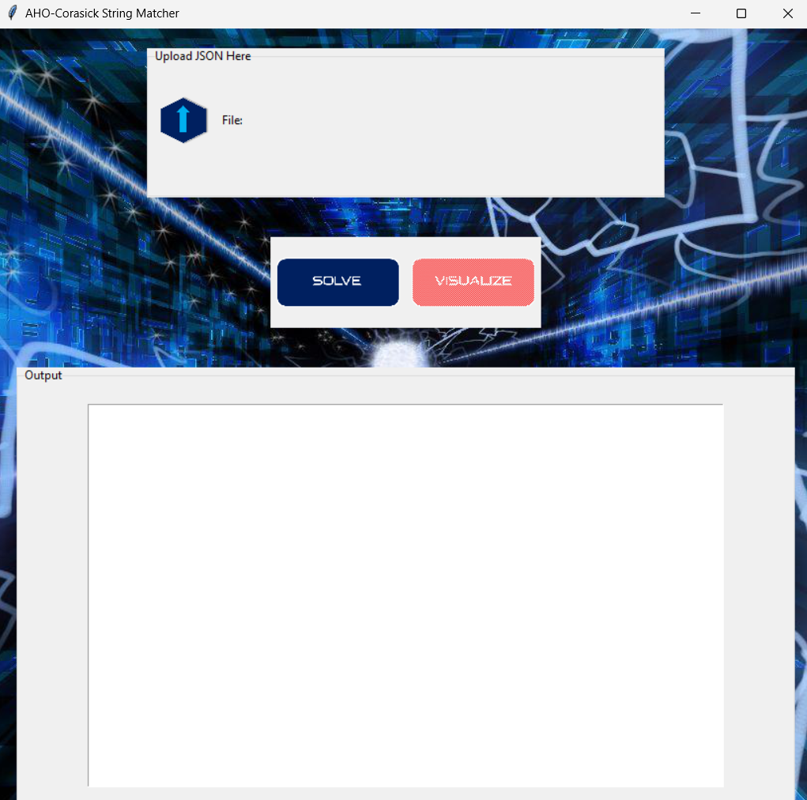
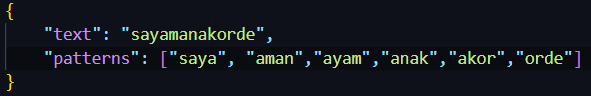
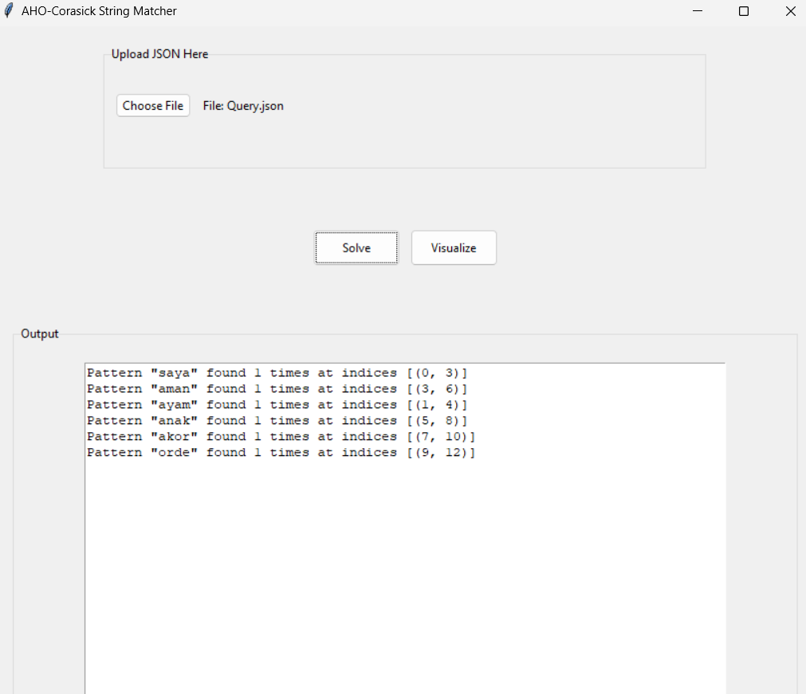
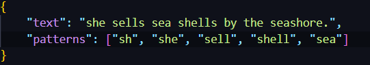
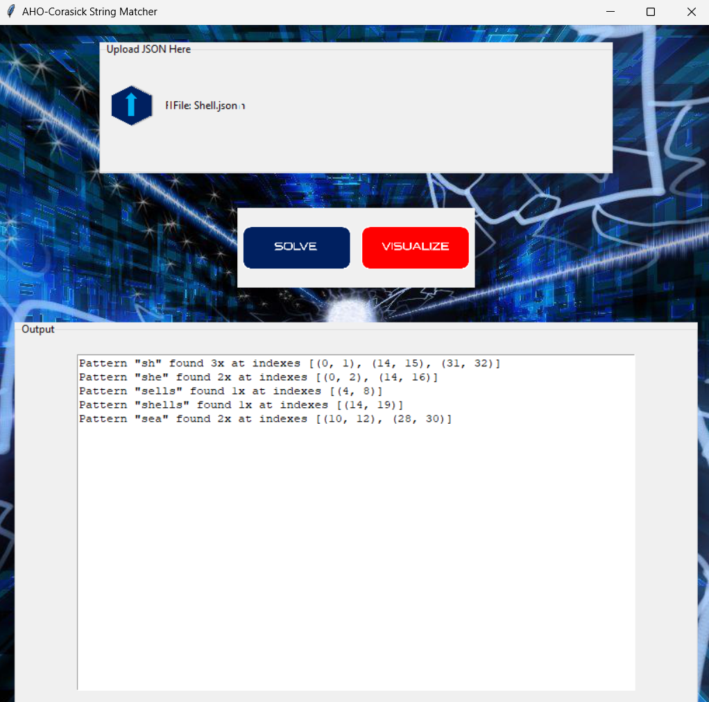
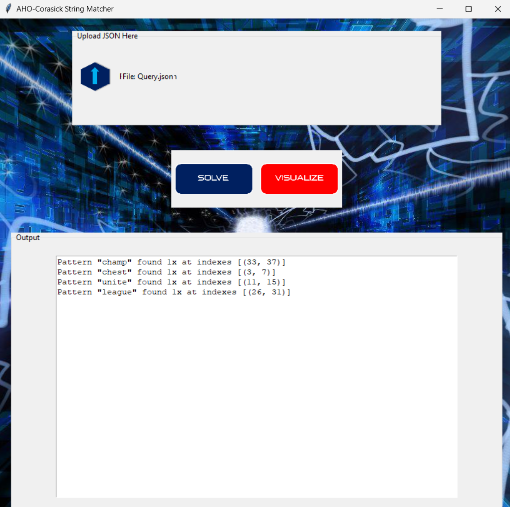

# Implementasi String Matching dengan Algoritma AHO-Corasick

> Seleksi Lab Ilmu Rekayasa dan Komputasi (IRK)

## **Daftar Isi**

- [Deskripsi Program](#deskripsi-program)
- [Requirement Program](#requirements-program)
- [Set Up dan Build Program](#set-up-dan-build-program)
- [Cara Menggunakan Program](#cara-menggunakan-program)
- [Home Page](#home-page)
- [Test](#test)
- [Author](#author)

## **Deskripsi Program**

<p align="justify">
Algoritma Aho–Corasick adalah algoritma pencarian string yang ditemukan oleh Alfred V. Aho dan Margaret J. Corasick pada tahun 1975. Ini adalah sejenis algoritma pencocokan kamus yang menempatkan elemen dari kumpulan string yang terbatas ("kamus") dalam sebuah Masukkan teks. Ini cocok dengan semua string secara bersamaan. Kompleksitas algoritma ini linier dalam panjang string ditambah panjang teks yang dicari ditambah jumlah keluaran yang cocok.

Repository ini berisi implementasi dalam mencari solusi terdekat dari sebuah permainan Word Ladder dan membandingkan ketiga algoritma UCS, Greedy Best First Search, dan A*

</p>

## **Requirements Program**
Program ini membutuhkan Python3 (Program ini dibuat di Python 3.12 sehingga disarankan menggunakan Python 3.12)

## **Set Up dan Build Program**
1. Download file .zip
2. Buka terminal dan pergi ke direktori src aplikasi 
     ```bash
     ./AHO-Corasick-IRK/src
     ```
3. Untuk buka program masukkan perintah:
     ```bash
     python Main.py
     ```

## **Cara Menggunakan Program** ##
1. Unggah file .json dengan menekan tombol Upload File (Folder data terdapat file Query.json yang bisa digunakan)
2. Tekan tombol "Solve" untuk melakukan string-matching
3. Tekan tombol "Visualize" untuk melihat graf visualisasi dari solusi yang didapat

## **Home Page**
<p align="center">

</p>

## **Test**
<p align="center">

Input 1:



Output 1:



Input 2:



Output 2:



Input 3:


Output 3:



Visualisasi 3:


</p>

## **Author**

|   NIM    |           Nama           |
| :------: | :----------------------: |
| 13522110 | Marvin Scifo Y. Hutahaean  |


<!-- Optional -->
<!-- ## License -->
<!-- This project is open source and available under the [... License](). -->

<!-- You don't have to include all sections - just the one's relevant to your project -->
