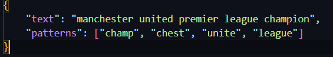

# Implementasi String Matching dengan Algoritma AHO-Corasick

> Seleksi Lab Ilmu Rekayasa dan Komputasi (IRK)

## **Daftar Isi**

- [Deskripsi Program](#deskripsi-program)
- [Requirement Program](#requirements-program)
- [Set Up dan Build Program](#set-up-dan-build-program)
- [Cara Menggunakan Program](#cara-menggunakan-program)
- [Home Page](#home-page)
- [Test](#test)
- [Author](#author)

## **Deskripsi Program**

<p align="justify">
Word ladder (juga dikenal sebagai Doublets, word-links, change-the-word puzzles, paragrams, laddergrams, atau word golf) adalah salah satu permainan kata yang terkenal bagi seluruh kalangan. Word ladder ditemukan oleh Lewis Carroll, seorang penulis dan matematikawan, pada tahun 1877. Pada permainan ini, pemain diberikan dua kata yang disebut sebagai start word dan end word. Untuk memenangkan permainan, pemain harus menemukan rantai kata yang dapat menghubungkan antara start word dan end word. Banyaknya huruf pada start word dan end word selalu sama. Tiap kata yang berdekatan dalam rantai kata tersebut hanya boleh berbeda satu huruf saja. Pada permainan ini, diharapkan solusi optimal, yaitu solusi yang meminimalkan banyaknya kata yang dimasukkan pada rantai kata.

Repository ini berisi implementasi dalam mencari solusi terdekat dari sebuah permainan Word Ladder dan membandingkan ketiga algoritma UCS, Greedy Best First Search, dan A*

</p>

## **Requirements Program**
Program ini membutuhkan Python3 (Program ini dibuat di Python 3.12 sehingga disarankan menggunakan Python 3.12)

## **Set Up dan Build Program**
1. Download file .zip
2. Buka terminal dan pergi ke direktori src aplikasi 
     ```bash
     ./AHO-Corasick-IRK/src
     ```
3. Untuk buka program masukkan perintah:
     ```bash
     python Main.py
     ```

## **Cara Menggunakan Program** ##
1. Unggah file .json dengan menekan tombol Upload File (Folder data terdapat file Query.json yang bisa digunakan)
2. Tekan tombol "Solve" untuk melakukan string-matching
3. Tekan tombol "Visualize" untuk melihat graf visualisasi dari solusi yang didapat

## **Home Page**
<p align="center">

</p>

## **Test**
<p align="center">

Input 1:


Output 1:


Input 2:


Output 2:


Input 3:



Output 3:


Visualisasi 3:


</p>

## **Author**

|   NIM    |           Nama           |
| :------: | :----------------------: |
| 13522110 | Marvin Scifo Y. Hutahaean  |


<!-- Optional -->
<!-- ## License -->
<!-- This project is open source and available under the [... License](). -->

<!-- You don't have to include all sections - just the one's relevant to your project -->
